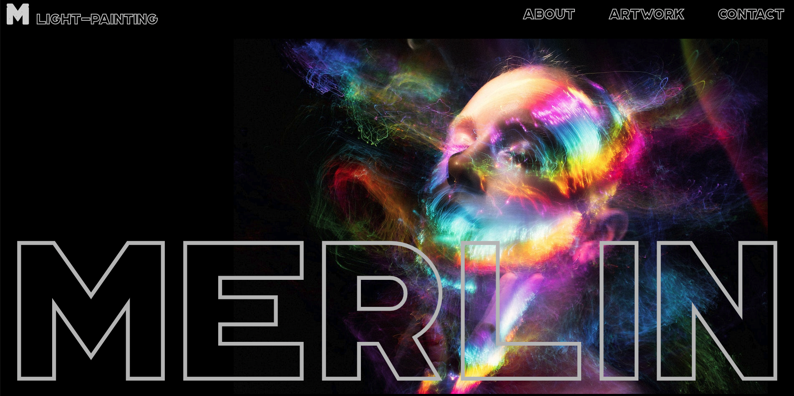

# Project Three- Artist Portfolio

This project is a sample portfolio website for an artist.  The website displays the artist's work, as well as their biography, contact information, and links to their website and their Instagram and Twitter accounts.  The app is designed to be managed by the artist through an admin login that allows them to upload and delete photos to be displayed on their portfolio.

# User Stories

- As a user, I should be able to view a well styled homepage with links to other pages: artwork, about, and contact

- On the artwork page, as a user, I will be able to view a list of photos the artist has created

- On the about page, as a user, I will be able to view the artist's biography

- On the contact page, as a user, I will be able to view links to the artist's web pages, online store and social media accounts

- As the admin of this website, the artist should be able to manage the content of the page by logging in through a hidden URL

- Once logged in, the artist will be able to use forms on the admin page to create new images and delete current ones from the page

# Technologies Used

- Node
- React
- Express
- Mongoose
- MongoDB
- Material UI

# Screenshots

- Wireframes:

- ERD

# Getting Started

[Click here](https://trello.com/invite/b/8qPUbezZ/135fe9b3bd995c501d78987d35b1fd1d/project-three) to see the project plan created with Trello.

[Click here](https://vast-castle-55899.herokuapp.com/) to see the deployed app!

# Future Enhancements

- Admin of the site will be able to use forms on each page to manage all of the portfolio content

- Admin's login will be protected by authentication via sessions/bcrypt or Google Firebase

- Artwork will be displayed in collections rather than just one image at a time

# Unsolved Problems

- TBD