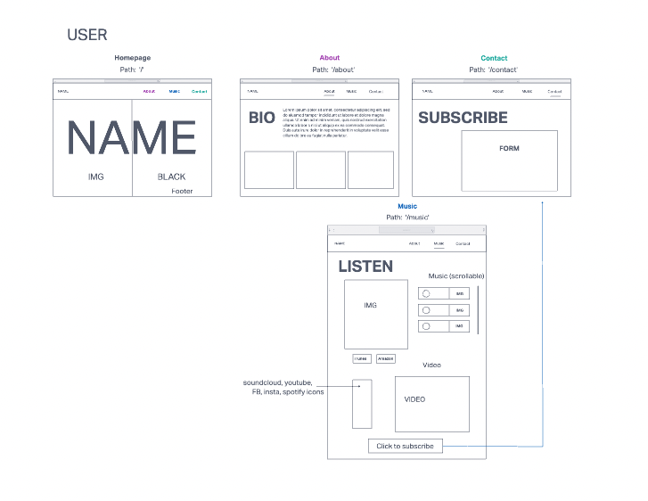
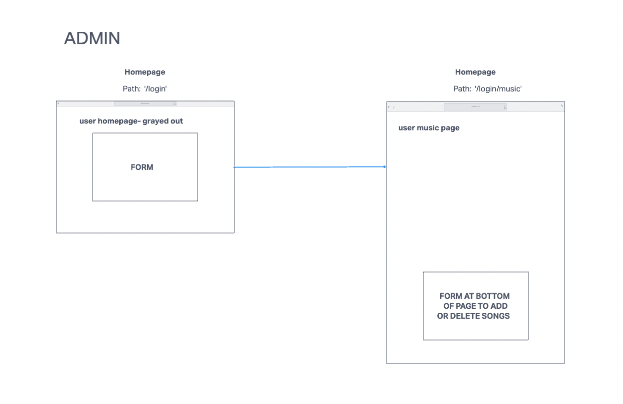
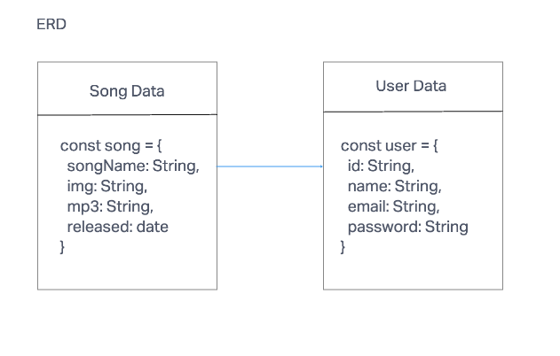

# Project Three- Musician Portfolio

This project is a sample portfolio website for a musician.  The website displays the musician's work, as well as their biography, contact information, and links to their YouTube channel and SoundCloud profile.

# User Stories

- As a user, I should be able to view a well styled homepage with links to other pages: music, about, and contact

- On the music page, as a user, I will be able to view a list of songs the musician has made and and click on each song to hear a short audio sample

    - On this page, I will also be able to click on links to the musician's YouTube channel and SoundCloud profile

- On the about page, as a user, I will be able to view the musician's biography and pictures of the musician

- On the contact page, as a user, I will be able to view a form to subscribe to the musician's newsletter for events and music release updates

- As the admin of this website, the musician should be able to manage the content of the page by logging in through a hidden URL

- Once logged in, the musician will be able to use forms on the music page to create new content and delete current content from the page

# Technologies Used

- Node
- React
- Express
- Mongoose
- MongoDB
- Material UI

# Screenshots

- Wireframes:

- ERD

- Screenshots of final product

# Getting Started

[Click here](https://trello.com/invite/b/8qPUbezZ/135fe9b3bd995c501d78987d35b1fd1d/project-three) to see the project plan created with Trello.

Click here to see the deployed app!

# Future Enhancements

- Admin of the site will be able to use forms on each page to manage all of the portfolio content

- Admin's login will be protected by authentication via sessions/bcrypt or Google Firebase

- Will include user stories from above that are not completed by the project deadline

# Unsolved Problems

- TBD